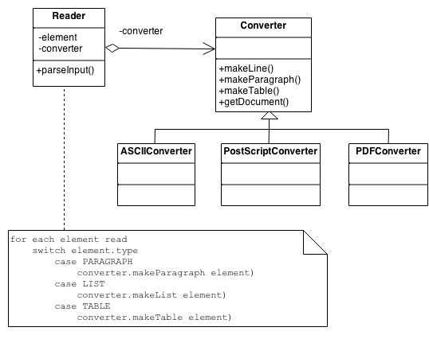

# Builder Pattern
## Intent
* Separate the construction of a complex object from its representation so that the same construction process can create different representations.
* Parse a complex representation, create one of several targets.

## Structure
The Reader encapsulates the parsing of the common input. The Builder hierarchy makes possible the polymorphic creation of many peculiar representations or targets.

## Example
For this pattern I implemented a restaurant's meal builder. The client can assemble his or her meal selecting a protein and two side dishes, each choice has it's price. Also he or she can add a beverage and a dessert.

Inside the index.spec.ts we execute a few scenarios and we assert them with automated tests.