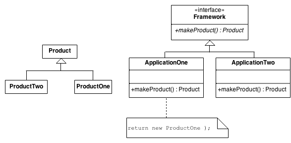

# Factory Pattern

## Intent
* Define an interface for creating an object, but let subclasses decide which class to instantiate. Factory Method lets a class defer instantiation to subclasses.
* Defining a "virtual" constructor.
* The new operator considered harmful.

## Structure
The implementation of Factory Method discussed in the Gang of Four (below) largely overlaps with that of Abstract Factory. For that reason, the presentation in this chapter focuses on the approach that has become popular since.

An increasingly popular definition of factory method is: a static method of a class that returns an object of that class' type. But unlike a constructor, the actual object it returns might be an instance of a subclass. Unlike a constructor, an existing object might be reused, instead of a new object created. Unlike a constructor, factory methods can have different and more descriptive names (e.g. Color.make_RGB_color(float red, float green, float blue) and Color.make_HSB_color(float hue, float saturation, float brightness)

The client is totally decoupled from the implementation details of derived classes. Polymorphic creation is now possible.

## Example
In this example a company called Mobil needs to handle a bundle of trips where a car picks up a person and after the race is ended, a fee is outputed to charge the passenger.

There are a few types of cars, each with a distinct tariff and time multiplier.

So the factory method handles new trips just using the `Trip.create()` method.