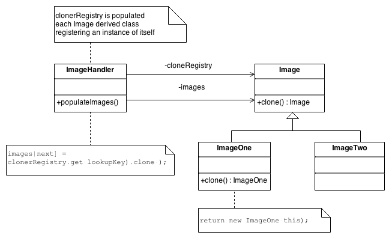

# Prototype Pattern
## Intent
* Specify the kinds of objects to create using a prototypical instance, and create new objects by copying this prototype.
* Co-opt one instance of a class for use as a breeder of all future instances.
* The new operator considered harmful.

## Structure
The Factory knows how to find the correct Prototype, and each Product knows how to spawn new instances of itself.

## Example
This is just a simple exemple where we have a Person class and we clone it and change some infos to test the new cloned instance.